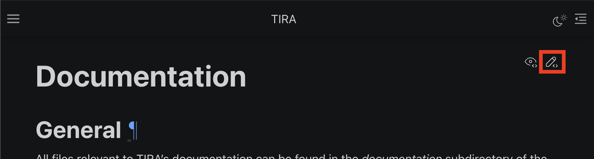

Adding Documentation
====================
General
-------
All files relevant to TIRA's documentation can be found in the `documentation` subdirectory of the
`repository <https://github.com/tira-io/tira>`_. To build it, open a shell in that directory and run

.. code:: bash

    make html

TIRA's documentation is generated using `Sphinx <https://www.sphinx-doc.org/>`_

Editing a page
--------------
To edit a specific page, you can either search for it within the repository or open TIRA's documentation to the page you
would like to edit and spot the edit-icon in the top right corner:

    The edit icon in the top right corner of any page opens the source file of the current page for editing in GitHub.
    The eye icon to the left of it lets you view the file in GitHub.

Creating a new page
-------------------
.. todo:: TODO

Glossary
--------
Terminology can be one of the biggest hurdles for users **and** developers. To help newcomers as well as we can, we
provide a :ref:`glossary <glossary>`. Please add any terms to the glossary that you find should be added or you see
users struggle with. The size of the glossary does not really matter since the reader is not expected to read or even
skim it all. Instead, link to the when using terms the user may not understand. This helps users who are unfamiliar
with the term since it gives them the option to help themselves, while it does not affect users familiar with the term
at all. To reference a glossary entry, use the ``:term:`` directive.

UML Diagrams
------------
A picture is worth a thousand words... especially when you want to convey procedures and architectures. We use two
alternative tools to create and integrate UML diagrams within our documentation: PlantUML and UMLet. PlantUML provides a
simple markup language for describing UML diagrams. In my experience, it is especially useful for creating nice looking
sequence diagrams efficiently. UMLet on the other hand requires you to create a separate ``.uxf`` file and include it
like a picture. If you need more flexibility (especially for positioning), then UMLet probably is what you are looking
for. In the following we give a quick overview on how diagrams can be integrated with both tools and it is up to you to
decide, which one suits your needs best.

PlantUML
~~~~~~~~
If you use the development container (see :ref:`DevEnvPage`), you don't need to install any dependencies otherwise,
please have a look at the `official PlantUML for Sphinx documentation <https://github.com/sphinx-contrib/plantuml>`_.
Adding a PlantUML diagram now simply consists of using the ``.. uml::`` directive with valid PlantUML code in its
content. You can find the official documentation `here <https://plantuml.com/>`_. It should 

.. grid:: 2

    .. grid-item::
        :columns: 12 4 4 4
        :child-align: center
        
        .. uml::
            :align: center
            :caption: I am a caption :)

            @startuml
            skinparam monochrome true
            skinparam BackgroundColor #fefefe
            hide footbox

            actor User
            participant A
            participant B
            participant C

            User -> A: get thing
            activate A
            A -> B: get thing
            activate B
            B --> A: no
            deactivate B
            A -> C: give thing to user
            activate C
            C -> User: here you go
            activate User
            User --> C: thanks
            deactivate User
            C --> A: done
            deactivate C
            A --> User
            deactivate A

            @enduml

    .. grid-item::
        :columns: 12 8 8 8
        
        .. code-block:: rst

            .. uml::
                :align: center
                :caption: I am a caption :)

                @startuml
                skinparam monochrome true
                skinparam BackgroundColor #fefefe
                hide footbox

                actor User
                participant A
                participant B
                participant C

                User -> A: get thing
                activate A
                A -> B: get thing
                activate B
                B --> A: no
                deactivate B
                A -> C: give thing to user
                activate C
                C -> User: here you go
                activate User
                User --> C: thanks
                deactivate User
                C --> A: done
                deactivate C
                A --> User
                deactivate A

                @enduml

.. todo:: TODO

UMLet
~~~~~~~
.. todo:: TODO

Deployment
----------
The documentation is automatically deployed when commits are pushed to the ``main`` and ``development`` branches. The
respective actions are
`build-documentation-production.yml <https://github.com/tira-io/tira/blob/main/.github/workflows/build-documentation-production.yml>`_ and
`build-documentation-nightly.yml <https://github.com/tira-io/tira/blob/main/.github/workflows/build-documentation-nightly.yml>`_.
The only difference between them is where they deploy to. The production documentation can be found at `tira-io.github.io/tira <https://tira-io.github.io/tira/>`_ and the nightly documentation is at `tira-io.github.io/tira/nightly <https://tira-io.github.io/tira/nightly>`_.

.. attention:: The deployment actions to GitHub pages **delete all other contents** of the branch when they build the
    documentation. If this was not done, the branch would grow with deleted parts of the documentation. However this
    means that you **should not manually add files** to the GitHub pages branch.

.. todo:: When we use GitHub Releases, we can build the release-documentation on-release and build the nightly
    documentation on pushes to ``main``.