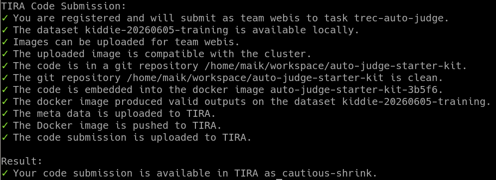
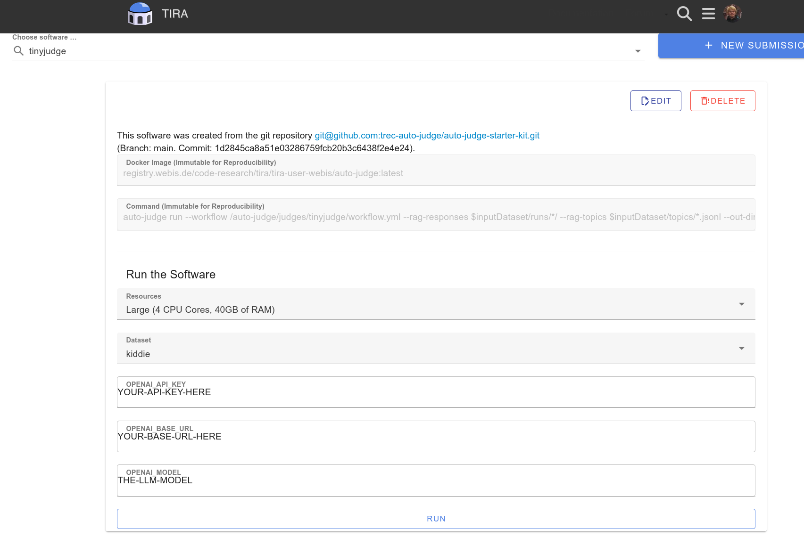

Usage of LLMs via REST API
==========================

TIRA usually executes software in a sandbox without internet access. If the organizers of a shared task explicitly allow
outbound network access, you can use large language models through a REST API from within your TIRA submission.

Please contact the organizers of your shared task to confirm that this is allowed for your specific setup.

.. warning::

    This page is still work in progress.

Handling LLM Credentials (Not Recommended)
~~~~~~~~~~~~~~~~~~~~~~~~~~~~~~~~~~~~~~~~~~

To use a large language model via a REST API, the software you execute through TIRA needs credentials for that API.
Ideally, your software should read them from environment variables such as ``OPENAI_API_KEY``, ``OPENAI_BASE_URL``, and
``OPENAI_MODEL``.

If the organizers allow it, TIRA can forward these environment variables to your software and disable the sandbox so
that your submission can reach the remote server hosting the model. TIRA does not persist forwarded environment
variables in long-term storage. However, they are passed through the `celery <https://docs.celeryq.dev>`_ queue so that `the worker <https://github.com/tira-io/tira/tree/main/worker>`_ running your
software can receive them (this can be considered a short-term storage).

Please handle API keys with extreme care:

1. Use a dedicated API key for the specific shared task.
2. Grant only the minimum permissions required.
3. Delete or revoke the key after your submission to the shared task.

TIRA is open source and we do our best to prevent credential leaks. Even so, the safest approach is to use dedicated,
short-lived credentials and remove them immediately after the shared task.

Use an OpenAI-Compatible Proxy (Recommended)
~~~~~~~~~~~~~~~~~~~~~~~~~~~~~~~~~~~~~~~~~~~~

As written above, it is the best to handle API keys with extreme care and ideally never forward real API keys to TIRA. Therefore, the recommended setup is to run an OpenAI-compatible proxy, such as `LiteLLM <https://github.com/BerriAI/litellm>`_, on
your own machine or server. Then forward only the proxy endpoint and proxy credentials to TIRA. After your
participation, remove the proxy and revoke the associated credentials.

This setup has two advantages:

1. Your production API key does not need to be forwarded to TIRA.
2. You can control and audit access more easily.

If you cannot host your own LiteLLM proxy, please contact the organizers of the shared task. The organizers can host a LiteLLM proxy and add your credentials there. That way, you still do not need to forward your production API key directly to TIRA, and the organizers can remind you after the shared task to revoke the API key.

Example TREC-AUTO-Judge
~~~~~~~~~~~~~~~~~~~~~~~

The following example shows how to use an LLM via a REST API in TIRA for the
`TREC-AUTO-Judge shared task <https://trec-auto-judge.cs.unh.edu/>`_. The example uses the
`tinyjudge reference implementation <https://github.com/trec-auto-judge/auto-judge-starter-kit/tree/main/judges/tinyjudge>`_
from the
`auto-judge-starter-kit <https://github.com/trec-auto-judge/auto-judge-starter-kit>`_ repository.

``tinyjudge`` expects the model configuration via the environment variables ``OPENAI_API_KEY``,
``OPENAI_BASE_URL``, and ``OPENAI_MODEL``.

1. Export the environment variables locally:

.. code-block:: bash

    export OPENAI_API_KEY=...
    export OPENAI_BASE_URL=...
    export OPENAI_MODEL=...

2. In the ``auto-judge-starter-kit`` repository, create a TIRA code submission. The example below uses
   ``--dry-run`` so that you can verify the setup locally first. Remove ``--dry-run`` once everything works as
   expected to upload the software to TIRA.

.. code-block:: bash

    tira-cli code-submission \
        --dry-run \
        --path . \
        --file judges/tinyjudge/Dockerfile \
        --task trec-auto-judge \
        --dataset kiddie-20260605-training \
        --forward-environment-variable OPENAI_API_KEY OPENAI_BASE_URL OPENAI_MODEL \
        --command 'auto-judge run --workflow /auto-judge/judges/tinyjudge/workflow.yml --rag-responses $inputDataset/runs/*/ --rag-topics $inputDataset/topics/*.jsonl --out-dir $outputDir'

This command tells TIRA to forward the three environment variables to the submission and to execute the
``tinyjudge`` workflow inside the container on your machine.

3. By removing ``--dry-run``, you can upload your software to TIRA.

The output should look similar to this:

    
    Uploading the software.

4. The uploaded software can be started in the TIRA web interface from your submission page where you can provide the
   environment variables.

    
    Running a software in TIRA with forwarded environment variables.

5. After the shared task, revoke the forwarded credentials or shut down the proxy that provided access to the model.

