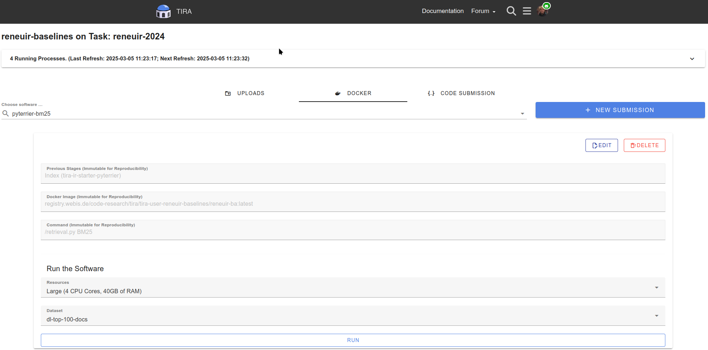

.. _ParticipatePage:

Participating in a Shared Task
==============================

.. note:: This tutorial assumes that you already created a user account. For the sake of the tutorial, we will create
    submissions for the ``ir-benchmarks`` task but it works the same for any other task.

.. _JoinTask:

Joining a Task and preparing your Environment
---------------------------------------------

To join a task, visit `tira.io/tasks <https://www.tira.io/tasks>`_, search for the task you would like to submit to,
and click its name to find the task's page.

Now you either have a button titled ``SUBMIT``, since you already
registered a group for this task, or it says ``REGISTER``. In the latter case, click on ``REGISTER``, fill out the form
that pops up appropriately, and confirm the registration by pressing ``Submit Registration``. After a reload, you should
see a ``SUBMIT`` button.

.. figure:: images/irbenchmarks_task_view.png
    :width: 300
    :align: center
    
    The task view for ``ir-benchmarks``. The ``REGISTER`` button could read ``SUBMIT``, if you are part of a group already.

Click on ``SUBMIT``. As you can see now, TIRA has three choices for submission (click on each respective tab to find
out more):

.. tab-set::

    .. tab-item:: Code Submission
        :sync: code-submission

        Code submission is the recommended form of submitting to TIRA. Code submissions are compatible with CI/CD systems like `Github Actions <https://github.com/features/actions>`_ and build a docker image from a git repository while collecting important experimental metadata to improve transparency and reproducibility.

        The requirements for code submissions are:

        (1) Your approach is in a git repository.
        (2) Your git repository is complete, i.e., contains all code and a Dockerfile to bundle the code.
        (3) Your git repository is clean.
            E.g., ``git status`` reports "nothing to commit, working tree clean".

        When those requirements are fulfilled, code submissions perform the following steps:

        (1) Build the docker image from the git repository while `tracking  important experimental meta data <https://github.com/tira-io/tirex-tracker>`_ (e.g., on git, code, etc.).
        (2) Run the docker image on a small spot check dataset to ensure it produces valid outputs.
        (3) Upload the docker image together with the meta data to TIRA.

    .. tab-item:: Docker Submission
        :sync: docker-submission

        .. todo:: TODO

    .. tab-item:: Run Upload
        :sync: upload-submission

        The upload submission is the simplest form of submitting and requires you to run the evaluation yourself and
        upload the :term:`runfile`. As such it has two notable drawbacks such that we discourage from using it:

        (1) Participants need access to the dataset. This may not be possible (e.g., due to legal reasons) or desirable
            (e.g., to avoid that future models profit from the author's analysis of the dataset).
        (2) The result is not verifiable -- the organizer can not ensure that your model actually produced the runfile.

.. hint:: If you want to use the simplest type of submission, we recommend a **Code Submission** as this works with Github Actions or other CI/CD automations.

.. _SubmitSubmission:

Submitting your Submission
--------------------------
At this point, you came up with a brilliant idea and would like to submit it to TIRA for evaluation and to take pride in
your leaderboard position.

(1) Optional: Uploading Artifacts (e.g., Hugging Face models required by your code)

(2) Submitting

    .. tab-set::

        .. tab-item:: Code Submission
            :sync: code-submission

            (1) Please install the TIRA client via ``pip3 install tira``.

            (2) Please authenticate your tira client using your API key. You get your API key after registration on TIRA on your submit page.

            (3) Ensure that your TIRA installation is valid by running ``tira-cli verify-installation``. A valid output should look like:

            .. figure:: images/tira-verify-installation.png
                :width: 700
                :align: center

            (4) Now you are ready to upload your code submission to TIRA. Assuming that you want to upload to your code in a directory ``approach-xyz`` to the task ``wows-eval``, the command ``tira-cli code-submission --path some-directory/ --task wows-eval`` would do the code submission. A valid output should look like:

            .. figure:: images/tira-code-submission.png
                :width: 900
                :align: center
            

        .. tab-item:: Docker Submission
            :sync: docker-submission

            .. todo:: TODO

        .. tab-item:: Run Upload
            :sync: upload-submission

            .. todo:: TODO

.. _ExecuteSubmission:

Execute Your Submission
-----------------------

Now that you have uploaded your code or docker submission, you can execute it within TIRA (this is not needed for run uploads). Navigate to your task page and select your submission. Then, select the resources and dataset on which your submission should, and click "RUN":

After your software was executed, you can directly see the outputs and evaluation scores for public training datasets. For private or test datasets, the organizers will manually review the output of your system and will contact you and in case there are errors.
